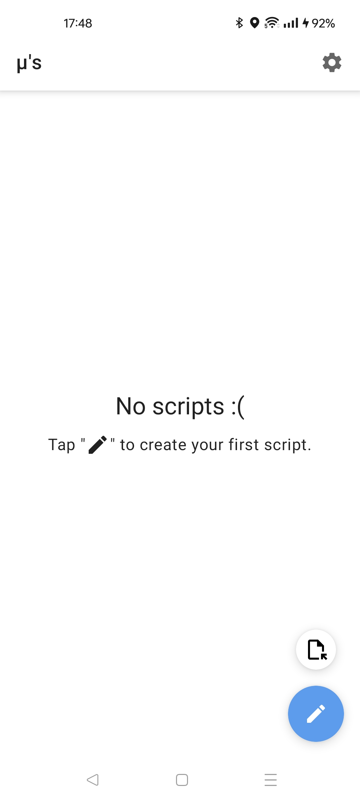
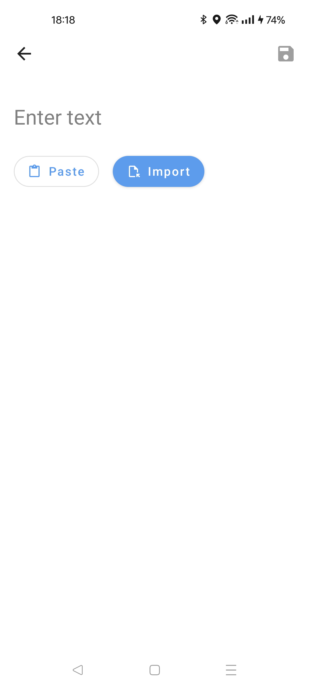
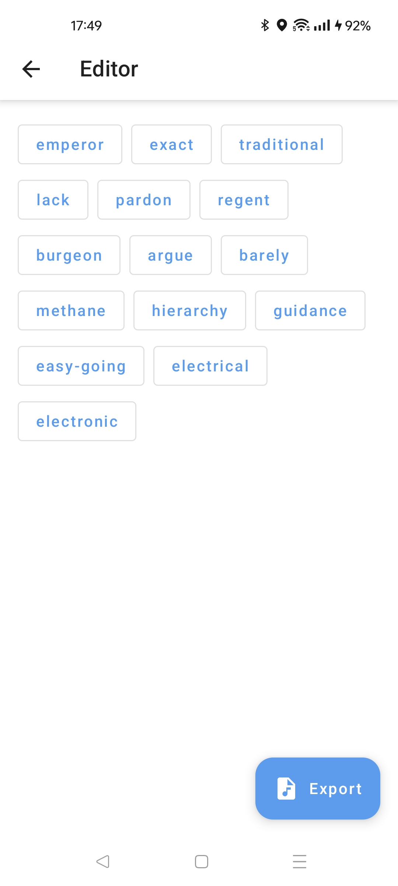
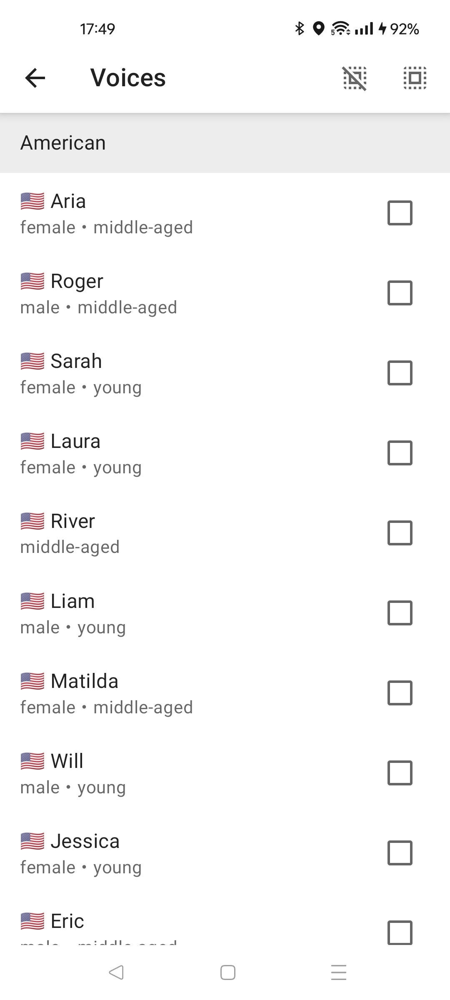
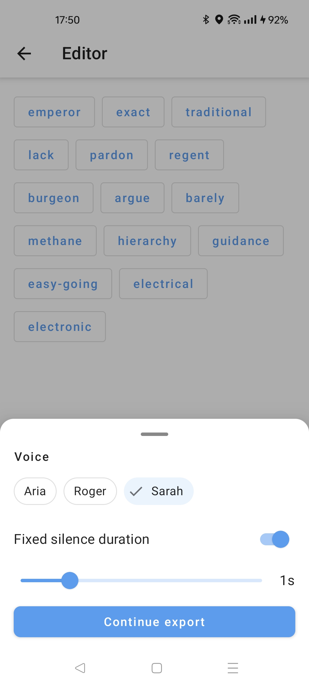
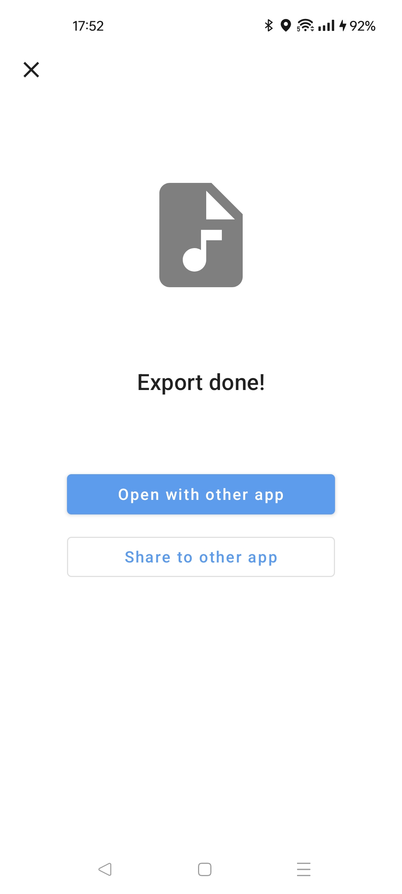

### Muse

Text to Speech

 

> It is recommended to use [foxy-droid](https://github.com/kitsunyan/foxy-droid) if you haven't installed the F-Droid client.

#### Preview

  

  

#### iOS Support
The latest version (v0.2.0 and above) supports building for iOS. You can use the `run_ios.sh` script to execute the iOS build process.

#### Development & Release
This project includes an AI agent skill to automate the release process.

A specialized **Muse Release Manager** skill handles the release SOP:
- **Versioning**: Automatic increment of `versionCode` and `versionName`.
- **Changelogs**: Automated generation of Android fastlane metadata.
- **Verification**: Pre-release build and test suite validation.

Skills are located in `.agents/skills/`. Ask the agent to "prepare the next release" to trigger the workflow.

